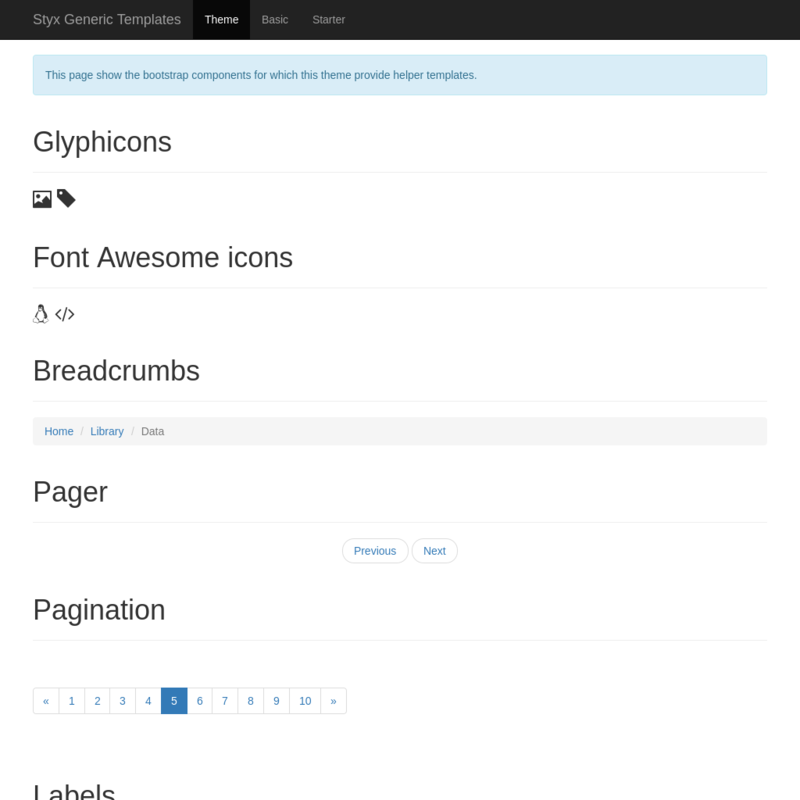
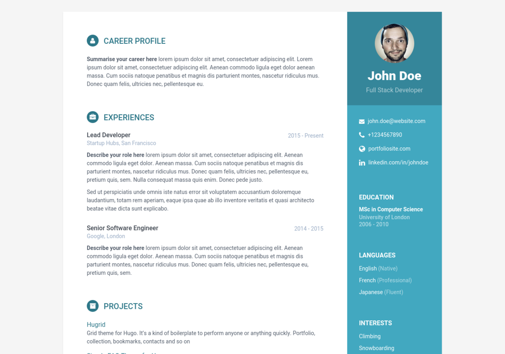
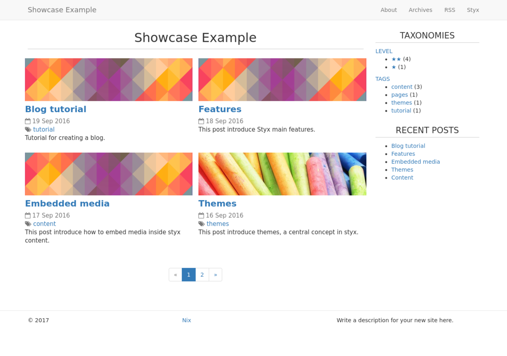

[[agency]]
== Agency

Port of the https://github.com/digitalcraftsman/hugo-agency-theme[Agency] theme for Styx.

Originally made by https://github.com/digitalcraftsman[digitalcraftsman].

https://github.com/digitalcraftsman/hugo-agency-theme[Original Theme]

> Agency Theme is a one page portfolio for companies and freelancers based on the original Bootstrap theme by David Miller. This Hugo theme features several content sections, a responsive portfolio grid with hover effects, full page portfolio item modals, a timeline, and a contact form.

---

- https://styx-static.github.io/styx-theme-agency[Demo]
- https://github.com/styx-static/styx-theme-agency[Homepage]

---

[[agency.doc]]
=== Documentation

:leveloffset: +2

This theme is a single page website. For more flexibility it split each section of the main page into dedicated blocks.

== Blocks

A block define a single part of a page, that can be ordered or manipulated independently.

The index page is using the `templates.block-page.full` special template that accept a special `block` argument. +
The `block` argument accept a list of blocks.

[source, nix]
.Example of block page declaration
----
  index = {
    title    = "Home";
    path     = "/index.html";
    template = templates.block-page.full;
    layout   = templates.layout;
    blocks   = [ 
      (template.blocks.banner data.main-banner)
      (templates.block.team   data.team)
    ];
  };
----

NOTE: `templates.block-page.full` is applying the library `processBlocks` function to the list of `blocks`, merging the blocks data into a single data attribute set.

=== Anatomy of a block

The library `processBlocks` function expects a block attribute set to define:

- `content`: The block content as a string.
- `extraJS`: List of javascript files to load when the block is used, optional.
- `extraCSS`: List of CSS files to load when the block is used, optional.

[source, nix]
.Simple block
----
{
  content = "Hello world!";
}
----

[source, nix]
.Block declaring resources
----
{
  content  = "Hello world!";
  extraCSS = [ "/js/hello.js" ];
  extraJS  = [ "/css/hello.css" ];
}
----

Usually, blocks are generated by applying a template to a data set like done in the example site.

NOTE: Blocks are meant to be flexible. For custom needs it is possible to use a custom block format and merge them with a custom `processBlocks` function.

:leveloffset: -2

[[agency.conf]]
=== Configuration interface

:sectnums!:

---

[[agency.theme.footer.copyright]]
==== theme.footer.copyright

Description:: Footer copyright text.
Type:: string
Default::
+
[source, nix]
----
"Published under the Apache License 2.0."
----

---

[[agency.theme.footer.quicklinks]]
==== theme.footer.quicklinks

Description:: Footer links.
Type:: list of attribute set
Default::
+
[source, nix]
----
[  ]
----

Example::
+
[source, nix]
----
[ {
  link = "#";
  text = "Privacy Policy";
} {
  link = "#";
  text = "Terms of Use";
} ]
----

---

[[agency.theme.footer.social]]
==== theme.footer.social

Description:: Social media links to display in the footer.
Type:: list of attribute set
Default::
+
[source, nix]
----
[  ]
----

Example::
+
[source, nix]
----
[ {
  icon = "fa-twitter";
  link = "#";
} {
  icon = "fa-facebook";
  link = "#";
} {
  icon = "fa-linkedin";
  link = "#";
} ]
----

---

[[agency.theme.lib.bootstrap.enable]]
==== theme.lib.bootstrap.enable

Default::
+
[source, nix]
----
true
----

---

[[agency.theme.lib.font-awesome.enable]]
==== theme.lib.font-awesome.enable

Default::
+
[source, nix]
----
true
----

---

[[agency.theme.lib.googlefonts]]
==== theme.lib.googlefonts

Default::
+
[source, nix]
----
[ "Montserrat:400,700" "Kaushan Script" "Droid Serif:400,700,400italic,700italic" "Roboto Slab:400,100,300,700" ]
----

---

[[agency.theme.lib.jquery.enable]]
==== theme.lib.jquery.enable

Default::
+
[source, nix]
----
true
----

---

[[agency.theme.site.author]]
==== theme.site.author

Description:: Content of the author `meta` tag.
Type:: string
Default::
+
[source, nix]
----
"Your name"
----

---

[[agency.theme.site.description]]
==== theme.site.description

Description:: Content of the description `meta` tag.
Type:: string
Default::
+
[source, nix]
----
"Your description"
----

---

[[agency.theme.site.title]]
==== theme.site.title

Description:: Title of the site.
Type:: string
Default::
+
[source, nix]
----
"The Agency"
----

---

:sectnums:

[[agency.templates]]
=== Templates

:sectnums!:

---

[[agency.templates.blocks.banner]]
==== templates.blocks.banner

---

[[agency.templates.blocks.basic]]
==== templates.blocks.basic

---

[[agency.templates.blocks.clients]]
==== templates.blocks.clients

---

[[agency.templates.blocks.contact]]
==== templates.blocks.contact

---

[[agency.templates.blocks.portfolio]]
==== templates.blocks.portfolio

---

[[agency.templates.blocks.services]]
==== templates.blocks.services

---

[[agency.templates.blocks.team]]
==== templates.blocks.team

---

[[agency.templates.blocks.timeline]]
==== templates.blocks.timeline

---

[[agency.templates.partials.content-post]]
==== templates.partials.content-post

---

[[agency.templates.partials.content-pre]]
==== templates.partials.content-pre

---

[[agency.templates.partials.head.css-custom]]
==== templates.partials.head.css-custom

---

[[agency.templates.partials.js-custom]]
==== templates.partials.js-custom

---

:sectnums:

[[agency.example]]
=== Example site source

[source, nix]
----
/*
  -----------------------------------------------------------------------------
   Init

   Initialization of Styx, should not be edited
-----------------------------------------------------------------------------
*/
{
  pkgs ? import <nixpkgs> {},
  extraConf ? {},
}: rec {
  /*
    -----------------------------------------------------------------------------
     Setup

     This section setup required variables
  -----------------------------------------------------------------------------
  */

  styx = import pkgs.styx {
    # Used packages
    inherit pkgs;

    # Used configuration
    config = [./conf.nix extraConf];

    # Loaded themes
    themes = let
      styx-themes = import pkgs.styx.themes;
    in [
      styx-themes.generic-templates
      ../.
    ];

    # Environment propagated to templates
    env = {inherit data pages;};
  };

  # Propagating initialized data
  inherit (styx.themes) conf files templates env lib;

  /*
    -----------------------------------------------------------------------------
     Data

     This section declares the data used by the site
  -----------------------------------------------------------------------------
  */

  data = with lib;
    {
      /*
      Menu using blocks
      */
      menu = let
        mkBlockSet = blocks:
          map (
            id:
              (lib.find {inherit id;} blocks)
              // {
                navbarClass = "page-scroll";
                url = "/#${id}";
              }
          );
      in
        (mkBlockSet pages.index.blocks ["services" "portfolio" "about" "team" "contact"])
        ++ [
          {
            title = "Styx";
            url = "https://styx-static.github.io/styx-site/";
          }
        ];
    }
    // (lib.loadDir {
      dir = ./data;
      inherit env;
      asAttrs = true;
    });

  /*
    -----------------------------------------------------------------------------
     Pages

     This section declares the pages that will be generated
  -----------------------------------------------------------------------------
  */

  pages = rec {
    index = {
      title = "Home";
      path = "/index.html";
      template = templates.block-page.full;
      layout = templates.layout;
      blocks = let
        darken = d: d // {class = "bg-light-gray";};
      in
        with templates.blocks; [
          (banner data.main-banner)
          (services data.services)
          (portfolio (darken data.portfolio))
          (timeline data.about)
          (team (darken data.team))
          (clients data.clients)
          (contact data.contact)
        ];
    };
  };

  /*
    -----------------------------------------------------------------------------
     Site rendering

  -----------------------------------------------------------------------------
  */

  # converting pages attribute set to a list
  pageList = lib.pagesToList {
    inherit pages;
    default = {layout = templates.layout;};
  };

  site = lib.mkSite {inherit files pageList;};
}

----

[[generic-templates]]
== Generic templates

Generic theme providing a template framework and templates for http://getbootstrap.com/components/[bootstrap components].

---

- https://styx-static.github.io/styx-theme-generic-templates[Demo]
- https://github.com/styx-static/styx-theme-generic-templates[Homepage]

---

[[generic-templates.doc]]
=== Documentation

:leveloffset: +2

Generic-templates is a special theme providing a template framework and meant to be used as a base for other themes.

Its main purpose is to be composed with other themes to reduce the amount of boilerplate code.

Showcase and Hyde themes take advantage of generic-templates.

This theme also provide templates for some link:http://getbootstrap.com/components/[bootstrap components].

== Layout structure

Generic templates provide a `templates.layout` template, divided in many partials that allow to quickly start or adapt a design to styx.

* `layout`
** `partials.doctype`: The `doctype` can be changed via the configuration interface `theme.html.doctype`.
** `partials.html`
*** `partials.head.default`: See below for head templates division.
*** `partials.body`
**** `partials.content-pre`: Pre content template, usually holds navigation bar, empty by default.
**** `partials.content`: Main content template, should be overriden to needs.
**** `partials.content-post`: Post content template, usually holds footer, empty by default.
**** `partials.js`
***** `lib.js.jquery`: Loading jquery javascript, controlled by `conf.theme.lib.jquery.enable`.
***** `lib.js.bootstrap`: Loading bootstrap javascript, controlled by `theme.lib.bootstrap.enable`.
***** `partials.js-custom`: Should be overriden to load custom javascript files, empty by default.
***** `partials.js-extra`: Add custom javascript that are set in the page attribute set `extraJS` attribute, allow to have custom javascript per page.

Head templates division:

* `partials.head.default`
** `partials.head.title-pre`
*** `partials.head.meta`: Include a few default `meta` tags, can be overriden to fit needs.
** `partials.head.title`
** `partials.head.title-post`
*** `partials.head.feed`: Create a link for `pages.feed` if it exists by default, can be overriden to fit needs.
*** `partials.head.css`
**** `lib.css.bootstrap`: Loading bootstrap css, controlled by `conf.theme.lib.bootstrap.enable`.
**** `lib.css.font-awesome`: Loading font-awesome css, controlled by `conf.theme.lib.font-awesome.enable`.
**** `partials.head.css-custom`: Should be overriden to load custom css files, empty by default.
**** `partials.head.css-extra`: Add custom css that are set in the page attribute set `extraCSS` attribute, allow to have custom css per page.
*** `partials.head.title-post-extra`: Can be overriden to fit needs, empty by default.

== Overriding a template

Any template from a theme can be overriden to fit needs.

To override a template, just copy it to a custom theme and change it to your liking:

[source, bash]
.Overriding the partials.content template
----
$ styx new theme foo --in ./themes # <1>
$ mkdir -p themes/foo/templates/partials/ # <2>
$ cp $(styx theme-path generic-templates)/templates/partials/content.nix themes/foo/templates/partials/content.nix # <3>
----

<1> Creating a new `foo` theme.
<2> Create the `themes/foo/templates/partials/` directory.
<3> Copy the generic-templates `templates/partials/content.nix` to the foo theme. +
This code use the generic-templates bundled with styx, to use another version clone the link:https://github.com/styx-static/styx-theme-generic-templates[generic-templates repo], select the desired version, and copy the file from there.

NOTE: Every template of this theme use the `documentedTemplate` function that allow to generate template documentation.

[source, nix]
.Combining generic-templates and my-theme
----
themes = [
  styx-themes.generic-templates
  ./themes/my-theme
];
----

:sectnums:

:leveloffset: -2

[[generic-templates.conf]]
=== Configuration interface

:sectnums!:

---

[[generic-templates.theme.html.doctype]]
==== theme.html.doctype

Description:: Doctype declaration to use.
Type:: one of "html5", "html4", "xhtml1"
Default::
+
[source, nix]
----
"html5"
----

---

[[generic-templates.theme.html.lang]]
==== theme.html.lang

Description:: An ISO 639-1 language code to set to the `html` tag.
Type:: string
Default::
+
[source, nix]
----
"en"
----

---

[[generic-templates.theme.lib.bootstrap.enable]]
==== theme.lib.bootstrap.enable

Description:: Whether to enable bootstrap.
Type:: boolean
Default::
+
[source, nix]
----
false
----

Example::
+
[source, nix]
----
true
----

---

[[generic-templates.theme.lib.bootstrap.version]]
==== theme.lib.bootstrap.version

Description:: Selects bootstrap version to use.
Type:: Concatenated string
Default::
+
[source, nix]
----
"3.3.7"
----

---

[[generic-templates.theme.lib.font-awesome.enable]]
==== theme.lib.font-awesome.enable

Description:: Whether to enable font awesome.
Type:: boolean
Default::
+
[source, nix]
----
false
----

Example::
+
[source, nix]
----
true
----

---

[[generic-templates.theme.lib.font-awesome.version]]
==== theme.lib.font-awesome.version

Description:: Selects font-awesome version to use.
Type:: Concatenated string
Default::
+
[source, nix]
----
"4.7.0"
----

---

[[generic-templates.theme.lib.googlefonts]]
==== theme.lib.googlefonts

Description:: Google Fonts to load, for available fonts see https://fonts.google.com/.
Type:: list of string
Default::
+
[source, nix]
----
[  ]
----

Example::
+
[source, nix]
----
[ "Barrio" "Fjalla One" ]
----

---

[[generic-templates.theme.lib.highlightjs.enable]]
==== theme.lib.highlightjs.enable

Description:: Whether to enable highlightjs.
Type:: boolean
Default::
+
[source, nix]
----
false
----

Example::
+
[source, nix]
----
true
----

---

[[generic-templates.theme.lib.highlightjs.extraLanguages]]
==== theme.lib.highlightjs.extraLanguages

Description:: Extra languages to highlight, for available languages see https://highlightjs.org/static/demo/.
Type:: list of string
Default::
+
[source, nix]
----
[  ]
----

Example::
+
[source, nix]
----
[ "nix" ]
----

---

[[generic-templates.theme.lib.highlightjs.style]]
==== theme.lib.highlightjs.style

Description:: Style used by highlight.js, for available styles see https://highlightjs.org/static/demo/.
Type:: Concatenated string
Default::
+
[source, nix]
----
"default"
----

Example::
+
[source, nix]
----
"agate"
----

---

[[generic-templates.theme.lib.highlightjs.version]]
==== theme.lib.highlightjs.version

Description:: Selects highlightjs version to use.
Type:: Concatenated string
Default::
+
[source, nix]
----
"9.9.0"
----

---

[[generic-templates.theme.lib.jquery.enable]]
==== theme.lib.jquery.enable

Description:: Whether to enable jQuery.
Type:: boolean
Default::
+
[source, nix]
----
false
----

Example::
+
[source, nix]
----
true
----

---

[[generic-templates.theme.lib.jquery.version]]
==== theme.lib.jquery.version

Description:: Selects jQuery version to use.
Type:: Concatenated string
Default::
+
[source, nix]
----
"3.1.1"
----

---

[[generic-templates.theme.lib.mathjax.enable]]
==== theme.lib.mathjax.enable

Description:: Whether to enable mathjax.
Type:: boolean
Default::
+
[source, nix]
----
false
----

Example::
+
[source, nix]
----
true
----

---

[[generic-templates.theme.services.disqus.shortname]]
==== theme.services.disqus.shortname

Description:: Disqus service shortname. See link:https://help.disqus.com/customer/portal/articles/466208-what-s-a-shortname-[What's a shortname?] page for details.
Type:: null or string
Default::
+
[source, nix]
----
null
----

---

[[generic-templates.theme.services.google-analytics.trackingID]]
==== theme.services.google-analytics.trackingID

Description:: Google analytics service tracker ID, Google analytics is disabled if set to null.
Type:: null or string
Default::
+
[source, nix]
----
null
----

---

[[generic-templates.theme.services.piwik.IDsite]]
==== theme.services.piwik.IDsite

Description:: idsite of the website you are tracking in Piwik.
Type:: string
Default::
+
[source, nix]
----
""
----

---

[[generic-templates.theme.services.piwik.enable]]
==== theme.services.piwik.enable

Description:: Whether to enable Piwik.
Type:: boolean
Default::
+
[source, nix]
----
false
----

Example::
+
[source, nix]
----
true
----

---

[[generic-templates.theme.services.piwik.url]]
==== theme.services.piwik.url

Description:: Piwik url.
Type:: string
Default::
+
[source, nix]
----
""
----

---

[[generic-templates.theme.site.title]]
==== theme.site.title

Description:: Site title.
Type:: string
Default::
+
[source, nix]
----
"Generic Templates"
----

---

:sectnums:

[[generic-templates.templates]]
=== Templates

:sectnums!:

---

[[generic-templates.templates.block-page.full]]
==== templates.block-page.full

---

[[generic-templates.templates.bootstrap.alert]]
==== templates.bootstrap.alert

Description:: Generate a bootstrap alert.
Arguments (Attribute Set)::
`content`::: Content of the alert. +
Type: `String`. 
`type`::: Type of the alert. +
Type: `"success" | "info" | "warning" | "danger"`. 

Example:: 
+
[source, nix]
.Code
----
templates.bootstrap.alert { type = "success"; content = "alert"; }
----

+
[source, html]
.Result
----

alert

----

---

[[generic-templates.templates.bootstrap.badge]]
==== templates.bootstrap.badge

Description:: Generate a bootstrap badge.
Arguments (Standard)::
`content`::: Content of the badge. +
Type: `String`. 

Example:: 
+
[source, nix]
.Code
----
templates.bootstrap.badge 42
----

+
[source, html]
.Result
----
42
----

---

[[generic-templates.templates.bootstrap.breadcrumbs]]
==== templates.bootstrap.breadcrumbs

Description:: Generate a page breadcrumbs; takes a page attribute with a `breadcrumbs` attribute containing a list of pages.
Arguments (Standard)::
`page`::: The page to generate breadcrumbs from. +
Type: `Page`. 

Example:: 
+
[source, nix]
.Code
----
templates.bootstrap.breadcrumbs {
  path = "/about.html";
  title = "About";
  breadcrumbs = [ { path = "/"; breadcrumbTitle = "Home"; title = "My site"; } ];
}

----

+
[source, html]
.Result
----
<ol class="breadcrumb">
  <li><a href="http://domain.org/">Home</a></li>
  <li class="active">About</li>
</ol>

----

---

[[generic-templates.templates.bootstrap.label]]
==== templates.bootstrap.label

Description:: Generate a bootstrap label.
Arguments (Attribute Set)::
`content`::: Content of the label. +
Type: `String`. 
`type`::: Type of the label. +
Type: `"default" | "primary" | "success" | "info" | "warning" | "danger"`.  +
Optional, defaults to `"default"`.

Example:: 
+
[source, nix]
.Code
----
templates.bootstrap.label { content = "my label"; type = "primary"; }
----

+
[source, html]
.Result
----
my label
----

---

[[generic-templates.templates.bootstrap.navbar.brand]]
==== templates.bootstrap.navbar.brand

Description:: Template used by default as the navbar brand, can be overriden to fit needs.

---

[[generic-templates.templates.bootstrap.navbar.default]]
==== templates.bootstrap.navbar.default

Description:: Generates a navbar.
Arguments (Attribute Set)::
`brand`::: HTML code of the brand section. +
Type: `String`.  +
Optional, defaults to `templates.bootstrap.navbar.brand`.
`content`::: Content of the navbar, usually a list of `templates.bootstrap.navbar.*` templates calls. +
Type: `String`. 
`extraClasses`::: Extra CSS classes to add to the navbar. +
Type: `[ String ]`.  +
Optional, defaults to `[  ]`.
`id`::: HTML `id` used by the navbar. +
Type: `String`.  +
Optional, defaults to `"navbar"`.
`inverted`::: Whether to make navbar inverted. +
Type: `Boolean`.  +
Optional, defaults to `false`.

Example:: 
+
[source, nix]
.Code
----
templates.bootstrap.navbar.default {
  inverted = true;
  brand = ''<a class="navbar-brand" href="#">Project Name</a>'';
  content = [
    (templates.bootstrap.navbar.nav {
      items = [
        { title = "Home";    path = "/#"; }
        { title = "About";   path = "/#about"; }
        { title = "Contact"; path = "/#contact"; }
      ];
      currentPage = { title = "Home"; path = "/#"; };
    })
  ];
}

----

+
[source, html]
.Result
----
<nav class="navbar navbar-inverse" id="navbar">

  <button type="button" class="navbar-toggle collapsed" data-toggle="collapse" data-target="#navbar-collapse" aria-expanded="false">
    Toggle navigation
    
    
    
  </button>
  <a class="navbar-brand" href="#">Project Name</a>

<ul class="nav navbar-nav">
<li class="active"><a href="http://domain.org/#">Home</a></li>
<li><a href="http://domain.org/#about">About</a></li>
<li><a href="http://domain.org/#contact">Contact</a></li>
</ul>

</nav>

----

---

[[generic-templates.templates.bootstrap.navbar.head]]
==== templates.bootstrap.navbar.head

Description:: Template used by `bootstrap.navbar.default`, not meant to be used directly.

---

[[generic-templates.templates.bootstrap.navbar.nav]]
==== templates.bootstrap.navbar.nav

Description:: Template to generate a navbar navigation list. Meant to be used in `bootstrap.navbar.default` `content` parameter.
Arguments (Attribute Set)::
`align`::: Alignment of the navigation. +
Type: `"right", "left" or null`.  +
Optional, defaults to `null`.
`currentPage`::: Current page viewed, used to make active the menu corresponding to the current page. +
Type: `Page or null`.  +
Optional, defaults to `null`.
`items`::: Items of the navbar. +
Type: `[ Pages ]`. 

Example:: 
+
[source, nix]
.Code
----
templates.bootstrap.navbar.nav {
  items = [
  { title = "Home";    path = "/#"; }
  { title = "About";   path = "/#about"; }
  { title = "Contact"; path = "/#contact"; }
  ];
  currentPage = { title = "Home"; path = "/#"; };
}

----

+
[source, html]
.Result
----
<ul class="nav navbar-nav">
<li class="active"><a href="http://domain.org/#">Home</a></li>
<li><a href="http://domain.org/#about">About</a></li>
<li><a href="http://domain.org/#contact">Contact</a></li>
</ul>
----

---

[[generic-templates.templates.bootstrap.navbar.nav_dropdown]]
==== templates.bootstrap.navbar.nav_dropdown

Description:: Generate a navbar nav dropdown menu. Meant to be used in `bootstrap.navbar.nav` context
Arguments (Standard)::
`title`::: Title +
Type: `String`. 
`items`::: Items of the dropdown menu +
Type: `[ Page ]`. 
`caret`::: Code added after the dropdown title +
Type: `String`.  +
Optional, defaults to `""`.

Example:: 
+
[source, nix]
.Code
----
templates.bootstrap.navbar.nav_dropdown { title = "Languages"; items = [ { title = "English"; path = "/eng"; } { title = "French"; path = "/fre"; } ]; }
----

+
[source, html]
.Result
----
<li class="dropdown">
<a href="#" class="dropdown-toggle" data-toggle="dropdown" role="button" aria-haspopup="true" aria-expanded="false">Languages</a>
<ul class="dropdown-menu">
<li><a href="http://domain.org/eng">English</a></li>
<li><a href="http://domain.org/fre">French</a></li>
</ul>
</li>
----

---

[[generic-templates.templates.bootstrap.navbar.nav_item]]
==== templates.bootstrap.navbar.nav_item

Description:: Generate a navbar nav item. Used internally by `bootstrap.navbar.nav`.
Arguments (Standard)::
`item`::: Item +
Type: `Page`. 
`currentPage`::: Current page displayed. +
Type: `[ Page ]`. 

Example:: 
+
[source, nix]
.Code
----
templates.bootstrap.navbar.nav_item { item = { title = "Home"; path = "/"; }; }
----

+
[source, html]
.Result
----
<li><a href="http://domain.org/">Home</a></li>
----

---

[[generic-templates.templates.bootstrap.navbar.text]]
==== templates.bootstrap.navbar.text

Description:: Template to generate a navbar text. Meant to be used in `bootstrap.navbar.default` `content` parameter.
Arguments (Attribute Set)::
`align`::: Alignment of the text. +
Type: `"right", "left" or null`.  +
Optional, defaults to `null`.
`content`::: Text content. +
Type: `String`. 
`extraClasses`::: Extra classes to add to the text. +
Type: `[ String ]`.  +
Optional, defaults to `[  ]`.

Example:: 
+
[source, nix]
.Code
----
templates.bootstrap.navbar.text {
  content = "Hello world!";
  align = "right";
}

----

+
[source, html]
.Result
----

Hello world!

----

---

[[generic-templates.templates.bootstrap.pager]]
==== templates.bootstrap.pager

Description:: Generate a pager
Arguments (Attribute Set)::
`index`::: Index of the current page. +
Type: `Integer`. 
`pages`::: List of pages. +
Type: `[ Page ]`. 

Example:: 
+
[source, nix]
.Code
----
templates.bootstrap.pager {
  pages = genList (x: { path = "/#${toString (x + 1)}"; }) 10;
  index = 5;
}

----

+
[source, html]
.Result
----
<nav aria-label="...">
<ul class="pager">
<li class="previous"><a href="http://domain.org/#4">&larr; Previous</a></li>
<li class="next"><a href="http://domain.org/#6">Next &rarr;</a></li>
</ul>
</nav>

----

---

[[generic-templates.templates.bootstrap.pagination]]
==== templates.bootstrap.pagination

Description:: Generate a pagination
Arguments (Attribute Set)::
`index`::: Index of the current page. +
Type: `Integer`. 
`pages`::: List of pages. +
Type: `[ Page ]`. 
`pagesLimit`::: Maximum number of pages to show in the pagination, if set to `null` all pages are in the pagination. +
Type: `Null | Int`.  +
Optional, defaults to `null`.

Example:: 
+
[source, nix]
.Code
----
templates.bootstrap.pagination {
  pages = genList (x: { path = "/#${toString (x + 1)}"; }) 10;
  index = 5;
}

----

+
[source, html]
.Result
----
<nav aria-label="Page navigation" class="pagination">
<ul class="pagination">
<li>
<a href="http://domain.org/#4" aria-label="Previous">
&laquo;
</a>
</li>
<li><a href="http://domain.org/#1">1</a></li>
<li><a href="http://domain.org/#2">2</a></li>
<li><a href="http://domain.org/#3">3</a></li>
<li><a href="http://domain.org/#4">4</a></li>
<li class="active"><a href="http://domain.org/#5">5</a></li>
<li><a href="http://domain.org/#6">6</a></li>
<li><a href="http://domain.org/#7">7</a></li>
<li><a href="http://domain.org/#8">8</a></li>
<li><a href="http://domain.org/#9">9</a></li>
<li><a href="http://domain.org/#10">10</a></li>
<li>
<a href="http://domain.org/#6" aria-label="Next">
&raquo;
</a>
</li>
</ul>
</nav>

----

---

[[generic-templates.templates.bootstrap.panel]]
==== templates.bootstrap.panel

Description:: Generate a bootstrap panel.
Arguments (Attribute Set)::
`body`::: Content of the panel body, set to `null` to disable the body. +
Type: `null | String`.  +
Optional, defaults to `null`.
`footer`::: Content of the panel footer, set to `null` to disable the footer. +
Type: `null | String`.  +
Optional, defaults to `null`.
`heading`::: Content of the panel heading, set to `null` to disable the heading. +
Type: `null | String`.  +
Optional, defaults to `null`.
`listGroup`::: Content of the panel list group, set to `null` to disable the body. +
Type: `null | String`.  +
Optional, defaults to `null`.
`type`::: Type of the panel. +
Type: `"default" | "primary" | "success" | "info" | "warning" | "danger"`.  +
Optional, defaults to `"default"`.

Example:: 
+
[source, nix]
.Code
----
templates.bootstrap.panel {
  type    = "danger";
  heading = ''<h3 class="panel-title">Panel title</h3>'';
  body    = "Panel content";
}

----

+
[source, html]
.Result
----

<h3 class="panel-title">Panel title</h3>

Panel content

----

---

[[generic-templates.templates.bootstrap.progress-bar]]
==== templates.bootstrap.progress-bar

Description:: Generate a bootstrap progress bar.
Arguments (Attribute Set)::
`type`::: Type of the progress bar. +
Type: `"success" | "info" | "warning" | "danger"`. 
`value`::: Value of the progress bar as percentage. +
Type: `Integer`. 

Example:: 
+
[source, nix]
.Code
----
templates.bootstrap.progress-bar { value = 60; }

----

+
[source, html]
.Result
----

  
60% Complete

----

---

[[generic-templates.templates.e404]]
==== templates.e404

Description:: Basic template for error 404 page, can be overriden to fit needs.

---

[[generic-templates.templates.examples.basic]]
==== templates.examples.basic

Description:: Template for the example site, internal use only.

---

[[generic-templates.templates.examples.starter]]
==== templates.examples.starter

Description:: Template for the example site, internal use only.

---

[[generic-templates.templates.examples.theme]]
==== templates.examples.theme

Description:: Template for the example site, internal use only.

---

[[generic-templates.templates.feed.atom]]
==== templates.feed.atom

Description:: Template generating an Atom feed. +
Take a page as argument. The page set can define extra attributes:

* `subtitle`: If set, will be used as the feed `subtitle`.
* `author.name`: If set, will be used as the feed `author`.
* `author.email`: If set, will be used as the feed `author`.
* `icon`: If set, will be used as the feed `icon`.
* `logo`: If set, will be used as the feed `logo`.
* `items`: The items to include in the feed as a list of pages.

---

[[generic-templates.templates.feed.atom-list]]
==== templates.feed.atom-list

Description:: Template generating an Atom feed entry. +
Used in `templates.feed.atom`.

---

[[generic-templates.templates.icon.bootstrap]]
==== templates.icon.bootstrap

Description:: Generate a bootstrap glyphicon markup from a glyphicon code.
Arguments (Standard)::
`icon`::: The icon code to use without the leading `glyphicon-`. See http://getbootstrap.com/components/#glyphicons for available icons. +
Type: `String`. 

Example:: 
+
[source, nix]
.Code
----
templates.icon.bootstrap "picture"
----

+
[source, html]
.Result
----

----

---

[[generic-templates.templates.icon.font-awesome]]
==== templates.icon.font-awesome

Description:: Generate a font-awesome icon markup from an icon code.
Arguments (Standard)::
`icon`::: The icon code to use without the leading `fa-`. See http://fontawesome.io/icons/ for available icons. +
Type: `String`. 

Example:: 
+
[source, nix]
.Code
----
templates.icon.font-awesome "code"
----

+
[source, html]
.Result
----
<i class="fa fa-code" aria-hidden="true"></i>
----

---

[[generic-templates.templates.layout]]
==== templates.layout

Description:: Generic layout template, includes <<templates.partials.doctype>> and <<templates.partials.html>>.

---

[[generic-templates.templates.lib.css.bootstrap]]
==== templates.lib.css.bootstrap

Description:: Template loading the bootstrap css library. Controlled by `conf.theme.lib.bootstrap.*` configuration options.

---

[[generic-templates.templates.lib.css.font-awesome]]
==== templates.lib.css.font-awesome

Description:: Template loading font-awesome css library. Controlled by `conf.theme.lib.font-awesome.*` configuration options.

---

[[generic-templates.templates.lib.css.googlefonts]]
==== templates.lib.css.googlefonts

Description:: Template loading google fonts fonts. Controlled by `conf.theme.lib.googlefonts.*` configuration options.

---

[[generic-templates.templates.lib.css.highlightjs]]
==== templates.lib.css.highlightjs

Description:: Template loading highlightjs required css. Controlled by `conf.theme.lib.highlightjs.*` configuration options.

---

[[generic-templates.templates.lib.js.bootstrap]]
==== templates.lib.js.bootstrap

Description:: Template loading the bootstrap javascript library. Controlled by `conf.theme.lib.jquery.*` configuration options.

---

[[generic-templates.templates.lib.js.highlightjs]]
==== templates.lib.js.highlightjs

Description:: Template loading the highlightjs javascript library. Controlled by `conf.theme.lib.highlightjs.*` configuration options.

---

[[generic-templates.templates.lib.js.jquery]]
==== templates.lib.js.jquery

Description:: Template loading the jQuery javascript library. Controlled by `conf.theme.lib.jquery.*` configuration options.

---

[[generic-templates.templates.lib.js.mathjax]]
==== templates.lib.js.mathjax

Description:: Template loading the MathJax javascript library. Controlled by `conf.theme.lib.mathjax.*` configuration options.

---

[[generic-templates.templates.media.giphy]]
==== templates.media.giphy

Description:: Template to embed a Giphy gif.
Arguments (Attribute Set)::
`height`::: Embedded gif height. +
Type: `Int`. 
`id`::: Giphy id. +
Type: `String`. 
`width`::: Embedded gif width. +
Type: `Int`. 

---

[[generic-templates.templates.media.gist]]
==== templates.media.gist

Description:: Template to embed a github gist.
Arguments (Attribute Set)::
`file`::: Gist file. +
Type: `Null | String`.  +
Optional, defaults to `null`.
`id`::: Gist id. +
Type: `String`. 
`user`::: Gist owner. +
Type: `String`. 

---

[[generic-templates.templates.media.slideshare]]
==== templates.media.slideshare

Description:: Template to embed a slideshare presentation.
Arguments (Attribute Set)::
`embedCode`::: Slides embed code. +
Type: `String`. 
`height`::: Embedded video height. +
Type: `Int`.  +
Optional, defaults to `315`.
`width`::: Embedded video width. +
Type: `Int`.  +
Optional, defaults to `560`.

---

[[generic-templates.templates.media.speakerdeck]]
==== templates.media.speakerdeck

Description:: Template to embed a speakerdeck presentation.
Arguments (Attribute Set)::
`id`::: Presentation id. +
Type: `String`. 
`slide`::: Slide to display. +
Type: `Null | Int`.  +
Optional, defaults to `null`.

---

[[generic-templates.templates.media.twitter]]
==== templates.media.twitter

Description:: Template to embed a twitter timeline.
Arguments (Attribute Set)::
`height`::: Embedded timeline height. +
Type: `Int`. 
`user`::: Twitter user. +
Type: `String`. 
`width`::: Embedded timeline width. +
Type: `Int`. 

---

[[generic-templates.templates.media.vimeo]]
==== templates.media.vimeo

Description:: Template to embed a Vimeo video.
Arguments (Attribute Set)::
`height`::: Embedded video height. +
Type: `Int`.  +
Optional, defaults to `360`.
`id`::: Video id. +
Type: `String`. 
`width`::: Embedded video width. +
Type: `Int`.  +
Optional, defaults to `640`.

---

[[generic-templates.templates.media.youtube]]
==== templates.media.youtube

Description:: Template to embed a Youtube video.
Arguments (Attribute Set)::
`height`::: Embedded video height. +
Type: `Int`.  +
Optional, defaults to `315`.
`id`::: Video id. +
Type: `String`. 
`width`::: Embedded video width. +
Type: `Int`.  +
Optional, defaults to `560`.

---

[[generic-templates.templates.page.full]]
==== templates.page.full

Description:: Normal template for rendering a page.

---

[[generic-templates.templates.page.list]]
==== templates.page.list

Description:: Normal template for rendering a page as a list entry (`li` tag).

---

[[generic-templates.templates.page.split]]
==== templates.page.split

Description:: Normal template for rendering splitted pages.

---

[[generic-templates.templates.partials.body]]
==== templates.partials.body

Description:: Template responsible for `body` tag rendering. `body` is divided in the following templates:

* <<templates.partials.content-pre>>
* <<templates.partials.content>>
* <<templates.partials.content-post>>
* <<templates.partials.js>>
** <<templates.lib.js.jquery>>
** <<templates.lib.js.bootstrap>>
** <<templates.partials.js-custom>>
** <<templates.partials.js-extra>>

---

[[generic-templates.templates.partials.content]]
==== templates.partials.content

Description:: Template rendering the page `content`.

---

[[generic-templates.templates.partials.content-post]]
==== templates.partials.content-post

Description:: Template rendering the page post-contents, usually used to render the footer. Empty by default.

---

[[generic-templates.templates.partials.content-pre]]
==== templates.partials.content-pre

Description:: Template rendering the page pre-contents, usually used to render navigations. Empty by default.

---

[[generic-templates.templates.partials.doctype]]
==== templates.partials.doctype

Description:: Template declaring the doctype, controlled by `conf.theme.html.doctype`.

---

[[generic-templates.templates.partials.head.css]]
==== templates.partials.head.css

Description:: Template loading the css files. Include the following templates:

- <<templates.lib.css.bootstrap>>
- <<templates.lib.css.font-awesome>>
- <<templates.lib.css.highlightjs>>
- <<templates.lib.css.googlefonts>>
- <<templates.partials.head.css-custom>>
- <<templates.partials.head.css-extra>>

---

[[generic-templates.templates.partials.head.css-custom]]
==== templates.partials.head.css-custom

Description:: Template to load custom css files, empty by default. Should be overridden to fit needs.

---

[[generic-templates.templates.partials.head.css-extra]]
==== templates.partials.head.css-extra

Description:: Template responsible for loading page specific css files. +
To be used, the Page should define an `extraCSS` attribute containing a list of attribute sets.

Example:: 
+
[source, nix]
.Code
----
pages.index = {
  layout   = templates.layout;
  template = templates.pages.full;
  path     = "/index.html";
  extraCSS = [ { href = "/css/index.css"; } ];
};

----

---

[[generic-templates.templates.partials.head.default]]
==== templates.partials.head.default

Description:: Template responsible for `head` tag rendering. `head` is divided in the following templates:

* <<templates.partials.head.title-pre>>
** <<templates.partials.head.meta>>
* <<templates.partials.head.title>>
* <<templates.partials.head.title-post>>
** <<templates.partials.head.feed>>
** <<templates.partials.head.css>>
*** <<templates.lib.css.bootstrap>>
*** <<templates.lib.css.font-awesome>>
*** <<templates.partials.head.css-custom>>
*** <<templates.partials.head.css-extra>>
** <<templates.partials.head.title-post-extra>>

---

[[generic-templates.templates.partials.head.feed]]
==== templates.partials.head.feed

Description:: Template that will automaticly load `pages.feed` if defined as an atom feed.

---

[[generic-templates.templates.partials.head.meta]]
==== templates.partials.head.meta

Description:: Generic `meta` tags, should be overriden to fit needs. +
Default contents:

+
[source, html]
----
<meta charset="utf-8">
<meta http-equiv="X-UA-Compatible" content="IE=edge">
<meta name="viewport" content="width=device-width, initial-scale=1">

----

---

[[generic-templates.templates.partials.head.title]]
==== templates.partials.head.title

Description:: Template rendering the page `head` `title` tag.

---

[[generic-templates.templates.partials.head.title-post]]
==== templates.partials.head.title-post

Description:: Template loading `head` tag contents after title. +
Includes <<templates.partials.head.feed>>, <<templates.partials.head.css>> and <<templates.partials.head.title-post-extra>>.

---

[[generic-templates.templates.partials.head.title-post-extra]]
==== templates.partials.head.title-post-extra

Description:: Template to add custom extra content in `head`. Empty by default, should be overriden to fit needs.

---

[[generic-templates.templates.partials.head.title-pre]]
==== templates.partials.head.title-pre

Description:: Template loading `head` tag contents before title. +
Includes <<templates.partials.head.meta>>.

---

[[generic-templates.templates.partials.html]]
==== templates.partials.html

Description:: Template responsible for generating the `html` tag, includes <<templates.partials.head.default>> and <<templates.partials.body>>.

---

[[generic-templates.templates.partials.js]]
==== templates.partials.js

Description:: Template loading the javascript files. Include the following templates:

- <<templates.lib.js.jquery>>
- <<templates.lib.js.bootstrap>>
- <<templates.lib.js.highlightjs>>
- <<templates.lib.js.mathjax>>
- <<templates.services.google-analytics>>
- <<templates.services.piwik>>
- <<templates.partials.js-custom>>
- <<templates.partials.js-extra>>

---

[[generic-templates.templates.partials.js-custom]]
==== templates.partials.js-custom

Description:: Template to load custom javascript files, empty by default. Should be overridden to fit needs.

---

[[generic-templates.templates.partials.js-extra]]
==== templates.partials.js-extra

Description:: Template responsible for loading page specific javascript files. +
To be used, the page should define an `extraJS` attribute containing a list of attribute sets that will be passed to `templates.tag.script`.

Example:: 
+
[source, nix]
.Code
----
pages.index = {
  layout   = templates.layout;
  template = templates.pages.full;
  path     = "/index.html";
  extraJS = [ { src = "/index.js"; }  ];
};

----

---

[[generic-templates.templates.services.disqus]]
==== templates.services.disqus

Description:: Template managing link:https://disqus.com/[disqus] integration. +
Before using disqus, `conf.theme.services.disqus.shortname` configuration option should be set. +
Page unique identifier will be automatically generated, but can be set by adding a `disqusID` attribute to the page.

Example:: 
+
[source, nix]
.Code
----
templates.services.disqus page

----

+
---
+
[source, nix]
.Code
----
templates.services.disqus (page // { disqusID = "main-thread"; })

----

---

[[generic-templates.templates.services.google-analytics]]
==== templates.services.google-analytics

Description:: Template managing link:https://www.google.com/analytics/[google analytics] integration. Controlled with `conf.theme.services.google-analytics.trackingID` configuration option.

---

[[generic-templates.templates.services.piwik]]
==== templates.services.piwik

Description:: Template managing link:https://piwik.org/[Piwik] integration. Controlled with `conf.theme.services.piwik.*` configuration options.

---

[[generic-templates.templates.sitemap]]
==== templates.sitemap

Description:: Template generating a link:https://en.wikipedia.org/wiki/Sitemaps[sitemap file]. +
Take a page with a `pages` attribute containing the list of pages to include in the sitemap. +
Pages in the list can define a `changefreq` attribute, else `monthly` will be used.

Example:: 
+
[source, nix]
.Code
----
sitemap = {
  path     = "/sitemap.xml";
  template = templates.sitemap;
  layout   = lib.id;
  pages    = lib.pagesToList { inherit pages; };
};

----

---

[[generic-templates.templates.tag.codeblock]]
==== templates.tag.codeblock

Description:: Template generating a code block, automatically escape HTML characters.

Arguments (Attribute Set)::
`content`::: Codeblock content. +
Type: `String`. 

Example:: 
+
[source, nix]
.Code
----
templates.tag.codeblock {
  content = "
some html
";
}

----

+
[source, html]
.Result
----
<pre><code>&lt;p&gt;some html&lt;/p&gt;</pre></code>
----

---

[[generic-templates.templates.tag.generic]]
==== templates.tag.generic

Description:: Template generating a generic html tag.

Arguments (Attribute Set)::
`content`::: Type: `String`. 
`tag`::: HTML tag to render. +
Type: `String`. 

Example:: 
+
[source, nix]
.Code
----
templates.tag.generic { tag = "div"; content = "hello world!"; class = "foo"; }

----

+
[source, html]
.Result
----

hello world!

----

+
---
+
[source, nix]
.Code
----
templates.tag.generic {
  tag = "div";
  content = templates.tag.generic { tag = "p"; content = "hello world!"; };
}

----

+
[source, html]
.Result
----

hello world!

----

[NOTE]
====
Any extra argument passed will be added as tag attributes.

====

---

[[generic-templates.templates.tag.ilink]]
==== templates.tag.ilink

Description:: Generate an **i**nternal **link**.
Arguments (Attribute Set)::
`to`::: Link target, can be a string or a page. +
Type: `String | Page`. 

Example:: 
+
[source, nix]
.Code
----
templates.tag.ilink { to = { path = "/about.html"; }; content = "about"; }
----

+
[source, html]
.Result
----
<a href="http://domain.org/about.html">about</a>
----

+
---
+
[source, nix]
.Code
----
templates.tag.ilink { to = "/files/manual.pdf"; content = "Download manual"; class = "download"; }
----

+
[source, html]
.Result
----
<a class="download" href="http://domain.org/files/manual.pdf">Download manual</a>
----

[NOTE]
====
Any extra argument passed will be added as tag attributes.

====

---

[[generic-templates.templates.tag.link]]
==== templates.tag.link

Description:: Template generating a `link` tag.

Example:: 
+
[source, nix]
.Code
----
templates.tag.link { href = "/feed.atom"; rel = "alternate"; type = "application/atom+xml"; }
----

+
[source, html]
.Result
----
<link href="/feed.atom" rel="alternate" type="application/atom+xml" />

----

---

[[generic-templates.templates.tag.link-atom]]
==== templates.tag.link-atom

Description:: Generate a `link` tag for an atom feed.

Example:: 
+
[source, nix]
.Code
----
templates.tag.link-atom { href = "/feed.atom"; }
----

+
[source, html]
.Result
----
<link href="/feed.atom" rel="alternate" type="application/atom+xml" />

----

---

[[generic-templates.templates.tag.link-css]]
==== templates.tag.link-css

Description:: Generate a `link` tag for a css file.

Example:: 
+
[source, nix]
.Code
----
templates.tag.link-css { href = "/css/style.css"; }
----

+
[source, html]
.Result
----
<link href="/css/style.css" rel="stylesheet" type="text/css" />

----

---

[[generic-templates.templates.tag.script]]
==== templates.tag.script

Description:: Template generating a `script` tag.

Arguments (Attribute Set)::
`src`::: Script source. +
Type: `String`. 

Example:: 
+
[source, nix]
.Code
----
templates.tag.script {
  src = "/script.js";
}

----

+
[source, html]
.Result
----

----

---

[[generic-templates.templates.taxonomy.full]]
==== templates.taxonomy.full

Description:: Template displaying a taxonomy information.

Arguments (Attribute Set)::
`page`::: Taxonomy page generated with `mkTaxonomyPages` function. +
Type: `page`. 

Example:: 
+
[source, nix]
.Code
----
pages.taxonomies = mkTaxonomyPages {
  data             = data.taxonomies.posts;
  taxonomyTemplate = templates.taxonomy.full;
  termTemplate     = templates.taxonomy.term.full;
};

----

+
---
+
[source, nix]
.Code
----
templates.taxonomy.full (getProp "tags" (mkTaxonomyData {
  data = [
    { tags = [ "foo" "bar" ]; path = "/a.html"; }
    { tags = [ "foo" ];       path = "/b.html"; }
    { category = [ "baz" ];   path = "/c.html"; }
  ];
  taxonomies = [ "tags" "category" ];
}))

----

+
[source, html]
.Result
----
<h1>tags</h1>
<ul>
<li><a href="http://domain.org/tags/foo/index.html">foo</a> (2)</li>
<li><a href="http://domain.org/tags/bar/index.html">bar</a> (1)</li>
</ul>

----

---

[[generic-templates.templates.taxonomy.term.full]]
==== templates.taxonomy.term.full

Description:: Template displaying a taxonomy term information.

Arguments (Attribute Set)::
`page`::: Taxonomy term page generated with `mkTaxonomyPages` function. +
Type: `page`. 

Example:: 
+
[source, nix]
.Code
----
pages.taxonomies = mkTaxonomyPages {
  data             = data.taxonomies.posts;
  taxonomyTemplate = templates.taxonomy.full;
  termTemplate     = templates.taxonomy.term.full;
};

----

+
---
+
[source, nix]
.Code
----
templates.taxonomy.term.full {
  taxonomy = "tags";
  term = "foo";
  values = getValue "foo" (getValue "tags" (mkTaxonomyData {
    data = [
      { tags = [ "foo" "bar" ]; path = "/a.html"; title = "a"; }
      { tags = [ "foo" ];       path = "/b.html"; title = "b";}
      { category = [ "baz" ];   path = "/c.html"; title = "c";}
    ];
    taxonomies = [ "tags" "category" ];
  }));
}

----

+
[source, html]
.Result
----
<h1>tags: foo</h1>
<ul>
<li><a href="http://domain.org/b.html">b</a></li>
<li><a href="http://domain.org/a.html">a</a></li>
</ul>

----

---

[[generic-templates.templates.taxonomy.term-list]]
==== templates.taxonomy.term-list

Description:: Template transforming raw taxonomy data.

Arguments (Standard)::
`taxonomyData`::: Taxonomy data. +
Type: `Taxonomy`. 

Example:: 
+
[source, nix]
.Code
----
templates.taxonomy.term-list (getProp "tags" (mkTaxonomyData {
  data = [
    { tags = [ "foo" "bar" ]; path = "/a.html"; }
    { tags = [ "foo" ];       path = "/b.html"; }
    { category = [ "baz" ];   path = "/c.html"; }
  ];
  taxonomies = [ "tags" "category" ];
}))

----

+
[source, nix]
.Result
----
[ {
  count = 2;
  path = "/tags/foo/index.html";
  taxonomy = "tags";
  term = "foo";
  values = [ {
    path = "/b.html";
    tags = [ "foo" ];
  } {
    path = "/a.html";
    tags = [ "foo" "bar" ];
  } ];
} {
  count = 1;
  path = "/tags/bar/index.html";
  taxonomy = "tags";
  term = "bar";
  values = [ {
    path = "/a.html";
    tags = [ "foo" "bar" ];
  } ];
} ]
----

---

[[generic-templates.templates.taxonomy.value.term-list]]
==== templates.taxonomy.value.term-list

Description:: Template generating a list of taxonomy terms data for a taxonomy value (page).

Arguments (Attribute Set)::
`page`::: Page attribute set. +
Type: `Page`. 
`taxonomy`::: Taxonomy name. +
Type: `String`. 

Example:: 
+
[source, nix]
.Code
----
templates.taxonomy.value.term-list {
  taxonomy = "tags";
  page = {
    tags = [ "foo" "bar" ];
  };
}

----

+
[source, nix]
.Result
----
[ {
  path = "/tags/foo/index.html";
  taxonomy = "tags";
  term = "foo";
} {
  path = "/tags/bar/index.html";
  taxonomy = "tags";
  term = "bar";
} ]
----

---

[[generic-templates.templates.url]]
==== templates.url

Description:: Generate a full url from a path or a page by using `conf.siteUrl`.
Arguments (Standard)::
`arg`::: Path or Page to generate the url. +
Type: `String | Page`. 

Example:: 
+
[source, nix]
.Code
----
templates.url "/foo.html"
----

+
[source, html]
.Result
----
http://domain.org/foo.html
----

+
---
+
[source, nix]
.Code
----
templates.url { title = "About"; path = "/about.html"; }
----

+
[source, html]
.Result
----
http://domain.org/about.html
----

---

:sectnums:

[[generic-templates.example]]
=== Example site source

[source, nix]
----
/*
  -----------------------------------------------------------------------------
   Init

   Initialization of Styx, should not be edited
-----------------------------------------------------------------------------
*/
{
  pkgs ? import <nixpkgs> {},
  extraConf ? {},
} @ args: rec {
  /*
    -----------------------------------------------------------------------------
     Setup

     This section setup required variables
  -----------------------------------------------------------------------------
  */

  styx = import pkgs.styx {
    # Used packages
    inherit pkgs;

    # Used configuration
    config = [./conf.nix extraConf];

    # Loaded themes
    themes = [../.];

    # Environment propagated to templates
    env = {inherit data pages;};
  };

  # Propagating initialized data
  inherit (styx.themes) conf files templates env lib;

  /*
    -----------------------------------------------------------------------------
     Data

     This section declares the data used by the site
  -----------------------------------------------------------------------------
  */

  data = {
    navbar = with pages; [theme basic starter];
  };

  /*
    -----------------------------------------------------------------------------
     Pages

     This section declares the pages that will be generated
  -----------------------------------------------------------------------------
  */

  /*
  http://getbootstrap.com/getting-started/#examples
  */

  pages = rec {
    basic = {
      layout = templates.layout;
      template = templates.examples.basic;
      path = "/basic.html";
      # example of adding extra css / js to a page
      #extraJS  = [ { src = "/pop.js"; crossorigin = "anonymous"; } ];
      #extraCSS = [ { href = "/pop.css"; } ];
      title = "Bootstrap 101 Template";
      navbarTitle = "Basic";
    };

    starter = {
      layout = templates.layout;
      template = templates.examples.starter;
      path = "/starter.html";
      title = "Starter Template for Bootstrap";
      navbarTitle = "Starter";
    };

    theme = {
      layout = templates.layout;
      template = templates.examples.theme;
      path = "/index.html";
      title = "Theme Template for Bootstrap";
      navbarTitle = "Theme";
    };
  };

  /*
    -----------------------------------------------------------------------------
     Site

  -----------------------------------------------------------------------------
  */

  /*
  Converting the pages attribute set to a list
  */
  pageList = lib.pagesToList {inherit pages;};

  /*
  Generating the site
  */
  site = lib.mkSite {inherit files pageList;};
}

----

[[ghostwriter]]
== Ghostwriter

Port of the https://github.com/jbub/ghostwriter[Ghostwriter] theme. +
Use the `generic-templates` theme.

---

- https://styx-static.github.io/styx-theme-ghostwriter[Demo]
- https://github.com/styx-static/styx-theme-ghostwriter[Homepage]

---

image::imgs/ghostwriter.png[Ghostwriter,align="center"]

[[ghostwriter.doc]]
=== Documentation

:leveloffset: +2

== Setting a navigation

Main navigation will be automatically created with the contents of `site.nix` `data.menu` contents.  
`data.menu` should be a list of pages or equivalent attributes sets defining at least the `title` and `url` attribute.

[source, nix]
.Declaring a menu
----
  data = {
    menu = [
      (head pages.index)
      pages.about
      { title = "Foo"; url = "/foo.html"; }
    ];
  };
----

== Adding author information to posts

An author is an attribute set consisting of a `name` and `url` attribute. (The `url` attribute is optional).
It is possible to set the author per post using markup file metadata:

[source, nix]
.Setting author via metadata
----
{---
title = "My post";
author = {
  name = "John Doe";
};
---}

# Lorem ipsum
----

It is also possible to create author data defined in `site.nix`.
For example, if there is the following declaration in `site.nix`:

[source, nix]
.Declaring author in site.nix
----
data = rec {
  authors.john = {
    name = "John Doe";
  };

  posts  = sortBy "date" "dsc" (loadDir { dir = ./posts; env = (env // { inherit authors; }); });
};
----

IMPORTANT: `authors` must be passed to the `env` of the function responsible of loading the posts. 

Then `authors.john` can be used in the metadata:

[source, nix]
.Setting author via metadata
----
{---
title = "My post";
author = authors.john;
---}

# Lorem ipsum
----

In case of a single author, it is possible to automatically set the same author to every post in `site.nix` during the posts pages creation.

[source, nix]
.Setting author during pages creation
----
posts = mkPageList {
  data        = data.posts;
  pathPrefix  = "/posts/";
  template    = templates.post.full;
  author      = { name = "John Doe"; };
};
----

:leveloffset: -2

[[ghostwriter.conf]]
=== Configuration interface

:sectnums!:

---

[[ghostwriter.theme.itemsPerPage]]
==== theme.itemsPerPage

Description:: Number of posts per page.
Type:: signed integer
Default::
+
[source, nix]
----
3
----

---

[[ghostwriter.theme.lib.font-awesome.enable]]
==== theme.lib.font-awesome.enable

Default::
+
[source, nix]
----
true
----

---

[[ghostwriter.theme.lib.googlefonts]]
==== theme.lib.googlefonts

Default::
+
[source, nix]
----
[ "Open Sans:300italic,400italic,600italic,700italic,400,600,700,300&subset=latin,cyrillic-ext,latin-ext,cyrillic" ]
----

---

[[ghostwriter.theme.lib.jquery.enable]]
==== theme.lib.jquery.enable

Default::
+
[source, nix]
----
true
----

---

[[ghostwriter.theme.site.copyright]]
==== theme.site.copyright

Description:: Site copyright.
Type:: string
Default::
+
[source, nix]
----
"&copy; 2017. All rights reserved.
"
----

---

[[ghostwriter.theme.site.description]]
==== theme.site.description

Description:: Site description.
Type:: string
Default::
+
[source, nix]
----
"Ghostwriter blog description
"
----

---

[[ghostwriter.theme.site.title]]
==== theme.site.title

Description:: Site title.
Type:: string
Default::
+
[source, nix]
----
"Ghostwriter Blog"
----

---

[[ghostwriter.theme.social.email]]
==== theme.social.email

Description:: GitHub link
Type:: null or Concatenated string
Default::
+
[source, nix]
----
null
----

---

[[ghostwriter.theme.social.github]]
==== theme.social.github

Description:: GitHub link
Type:: null or Concatenated string
Default::
+
[source, nix]
----
null
----

---

[[ghostwriter.theme.social.gitlab]]
==== theme.social.gitlab

Description:: GitHub link
Type:: null or Concatenated string
Default::
+
[source, nix]
----
null
----

---

[[ghostwriter.theme.social.google-plus]]
==== theme.social.google-plus

Description:: Google plus link
Type:: null or Concatenated string
Default::
+
[source, nix]
----
null
----

---

[[ghostwriter.theme.social.linked-in]]
==== theme.social.linked-in

Description:: Linked in link
Type:: null or Concatenated string
Default::
+
[source, nix]
----
null
----

---

[[ghostwriter.theme.social.stack-overflow]]
==== theme.social.stack-overflow

Description:: Stack overflow link
Type:: null or Concatenated string
Default::
+
[source, nix]
----
null
----

---

[[ghostwriter.theme.social.twitter]]
==== theme.social.twitter

Description:: Twitter link
Type:: null or Concatenated string
Default::
+
[source, nix]
----
null
----

---

:sectnums:

[[ghostwriter.templates]]
=== Templates

:sectnums!:

---

[[ghostwriter.templates.index]]
==== templates.index

---

[[ghostwriter.templates.page.full]]
==== templates.page.full

---

[[ghostwriter.templates.partials.content]]
==== templates.partials.content

---

[[ghostwriter.templates.partials.content-post]]
==== templates.partials.content-post

---

[[ghostwriter.templates.partials.content-pre]]
==== templates.partials.content-pre

---

[[ghostwriter.templates.partials.head.css-custom]]
==== templates.partials.head.css-custom

---

[[ghostwriter.templates.partials.head.title-post-extra]]
==== templates.partials.head.title-post-extra

---

[[ghostwriter.templates.partials.html]]
==== templates.partials.html

---

[[ghostwriter.templates.partials.pager]]
==== templates.partials.pager

---

[[ghostwriter.templates.post.full]]
==== templates.post.full

---

[[ghostwriter.templates.post.list]]
==== templates.post.list

---

:sectnums:

[[ghostwriter.example]]
=== Example site source

[source, nix]
----
/*
  -----------------------------------------------------------------------------
   Init

   Initialization of Styx, should not be edited
-----------------------------------------------------------------------------
*/
{
  pkgs ? import <nixpkgs> {},
  extraConf ? {},
}: rec {
  /*
    -----------------------------------------------------------------------------
     Setup

     This section setup required variables
  -----------------------------------------------------------------------------
  */

  styx = import pkgs.styx {
    # Used packages
    inherit pkgs;

    # Used configuration
    config = [./conf.nix extraConf];

    # Loaded themes
    themes = let
      styx-themes = import pkgs.styx.themes;
    in [
      styx-themes.generic-templates
      ../.
    ];

    # Environment propagated to templates
    env = {inherit data pages;};
  };

  # Propagating initialized data
  inherit (styx.themes) conf files templates env lib;

  /*
    -----------------------------------------------------------------------------
     Data

     This section declares the data used by the site
  -----------------------------------------------------------------------------
  */

  data = with lib; {
    # loading a single page
    about = loadFile {
      file = "${pkgs.styx}/share/styx/scaffold/sample-data/pages/about.md";
      inherit env;
    };

    # loading a list of contents
    posts = sortBy "date" "dsc" (loadDir {
      dir = "${pkgs.styx}/share/styx/scaffold/sample-data/posts";
      inherit env;
    });

    menu = [
      (head pages.index)
      pages.about
    ];

    # Create an author data
    author = {
      name = "John Doe";
      # It is possible to set a link to the author
      # url = "http://john-doe.org/";
    };
  };

  /*
    -----------------------------------------------------------------------------
     Pages

     This section declares the pages that will be generated
  -----------------------------------------------------------------------------
  */

  pages = with lib; rec {
    index = mkSplit {
      title = "Home";
      basePath = "/index";
      itemsPerPage = conf.theme.itemsPerPage;
      template = templates.index;
      data = posts.list;
    };

    /*
    Feed page
    */
    feed = {
      path = "/feed.xml";
      template = templates.feed.atom;
      # Bypassing the layout
      layout = id;
      items = take 10 posts.list;
    };

    about =
      {
        path = "/about.html";
        template = templates.page.full;
      }
      // data.about;

    posts = mkPageList {
      data = data.posts;
      pathPrefix = "/posts/";
      template = templates.post.full;
      # Attach the author to every blog post
      author = data.author;
    };
  };

  /*
    -----------------------------------------------------------------------------
     Site

  -----------------------------------------------------------------------------
  */

  /*
  Converting the pages attribute set to a list
  */
  pageList = lib.pagesToList {
    inherit pages;
    default = {layout = templates.layout;};
  };

  /*
  Generating the site
  */
  site = lib.mkSite {inherit files pageList;};
}

----

[[hyde]]
== Hyde

Port of the https://github.com/poole/hyde[Hyde] theme. +
Requires the `generic-templates` theme.

---

- https://styx-static.github.io/styx-theme-hyde[Demo]
- https://github.com/styx-static/styx-theme-hyde[Homepage]

---

image::imgs/hyde.png[Hyde,align="center"]

[[hyde.conf]]
=== Configuration interface

:sectnums!:

---

[[hyde.theme.colorScheme]]
==== theme.colorScheme

Description:: Selects the color scheme. Set to `null` for default black scheme.
Type:: null or one of "08", "09", "0a", "0b", "0c", "0d", "0e", "0f"
Default::
+
[source, nix]
----
null
----

---

[[hyde.theme.itemsPerPage]]
==== theme.itemsPerPage

Description:: Number of posts per page.
Type:: signed integer
Default::
+
[source, nix]
----
3
----

---

[[hyde.theme.layout.reverse]]
==== theme.layout.reverse

Description:: Whether to enable reverse layout.
Type:: boolean
Default::
+
[source, nix]
----
false
----

Example::
+
[source, nix]
----
true
----

---

[[hyde.theme.site.copyright]]
==== theme.site.copyright

Description:: Site copyright.
Type:: string
Default::
+
[source, nix]
----
"&copy; 2017. All rights reserved.
"
----

---

[[hyde.theme.site.description]]
==== theme.site.description

Description:: Site description.
Type:: string
Default::
+
[source, nix]
----
"An elegant open source and mobile first theme for styx made by <a href=\"http://twitter.com/mdo\">@mdo</a>. Originally made for Jekyll.
"
----

---

[[hyde.theme.site.title]]
==== theme.site.title

Description:: Site title.
Type:: string
Default::
+
[source, nix]
----
"Hyde"
----

---

:sectnums:

[[hyde.templates]]
=== Templates

:sectnums!:

---

[[hyde.templates.e404]]
==== templates.e404

---

[[hyde.templates.index]]
==== templates.index

---

[[hyde.templates.partials.body]]
==== templates.partials.body

---

[[hyde.templates.partials.content]]
==== templates.partials.content

---

[[hyde.templates.partials.content-pre]]
==== templates.partials.content-pre

---

[[hyde.templates.partials.head.css-custom]]
==== templates.partials.head.css-custom

---

[[hyde.templates.partials.head.title-post-extra]]
==== templates.partials.head.title-post-extra

---

[[hyde.templates.partials.pager]]
==== templates.partials.pager

---

[[hyde.templates.post.full]]
==== templates.post.full

---

[[hyde.templates.post.list]]
==== templates.post.list

---

:sectnums:

[[hyde.example]]
=== Example site source

[source, nix]
----
/*
  -----------------------------------------------------------------------------
   Init

   Initialization of Styx, should not be edited
-----------------------------------------------------------------------------
*/
{
  pkgs ? import <nixpkgs> {},
  extraConf ? {},
}: rec {
  /*
    -----------------------------------------------------------------------------
     Setup

     This section setup required variables
  -----------------------------------------------------------------------------
  */

  styx = import pkgs.styx {
    # Used packages
    inherit pkgs;

    # Used configuration
    config = [./conf.nix extraConf];

    # Loaded themes
    themes = let
      styx-themes = import pkgs.styx.themes;
    in [
      styx-themes.generic-templates
      ../.
    ];

    # Environment propagated to templates
    env = {inherit data pages;};
  };

  # Propagating initialized data
  inherit (styx.themes) conf files templates env lib;

  /*
    -----------------------------------------------------------------------------
     Data

     This section declares the data used by the site
  -----------------------------------------------------------------------------
  */

  data = with lib; {
    # loading a single page
    about = loadFile {
      file = "${pkgs.styx}/share/styx/scaffold/sample-data//pages/about.md";
      inherit env;
    };

    # loading a list of contents
    posts = sortBy "date" "dsc" (loadDir {
      dir = "${pkgs.styx}/share/styx/scaffold/sample-data/posts";
      inherit env;
    });

    # menu declaration
    menu = [pages.about];
  };

  /*
    -----------------------------------------------------------------------------
     Pages

     This section declares the pages that will be generated
  -----------------------------------------------------------------------------
  */

  pages = with lib; rec {
    /*
    Index page
    Splitting a list of items through multiple pages
    For more complex needs, mkSplitCustom is available
    */
    index = mkSplit {
      title = "Home";
      basePath = "/index";
      itemsPerPage = conf.theme.itemsPerPage;
      template = templates.index;
      data = posts.list;
    };

    /*
    About page
    Example of generating a page from imported data
    */
    about =
      {
        path = "/about.html";
        template = templates.page.full;
      }
      // data.about;

    /*
    Feed page
    */
    feed = {
      path = "/feed.xml";
      template = templates.feed.atom;
      # Bypassing the layout
      layout = id;
      items = take 10 posts.list;
    };

    /*
    404 error page
    */
    e404 = {
      path = "/404.html";
      template = templates.e404;
    };

    /*
    Posts pages
    */
    posts = mkPageList {
      data = data.posts;
      pathPrefix = "/posts/";
      template = templates.post.full;
      breadcrumbs = [(head pages.index)];
    };
  };

  /*
    -----------------------------------------------------------------------------
     Site rendering

  -----------------------------------------------------------------------------
  */

  # converting pages attribute set to a list
  pageList = lib.pagesToList {
    inherit pages;
    default = {layout = templates.layout;};
  };

  site = lib.mkSite {inherit files pageList;};
}

----

[[nix]]
== Nix

Port of the https://github.com/LordMathis/hugo-theme-nix[nix] theme. +
Requires the `generic-templates` theme.

---

- https://styx-static.github.io/styx-theme-nix[Demo]
- https://github.com/styx-static/styx-theme-nix[Homepage]

---

image::imgs/nix.png[Nix,align="center"]

[[nix.conf]]
=== Configuration interface

:sectnums!:

---

[[nix.theme.lib.bootstrap.enable]]
==== theme.lib.bootstrap.enable

Default::
+
[source, nix]
----
true
----

---

[[nix.theme.lib.font-awesome.enable]]
==== theme.lib.font-awesome.enable

Default::
+
[source, nix]
----
true
----

---

[[nix.theme.lib.googlefonts]]
==== theme.lib.googlefonts

Default::
+
[source, nix]
----
[ "Inconsolata" "Open+Sans" "Roboto" "Montserrat" "Concert One" ]
----

---

[[nix.theme.lib.jquery.enable]]
==== theme.lib.jquery.enable

Default::
+
[source, nix]
----
true
----

---

[[nix.theme.site.copyright]]
==== theme.site.copyright

Description:: Site copyright.
Type:: string
Default::
+
[source, nix]
----
"&copy; 2017. All rights reserved.
"
----

---

[[nix.theme.site.description]]
==== theme.site.description

Description:: Site description.
Type:: string
Default::
+
[source, nix]
----
"Nix blog description
"
----

---

[[nix.theme.site.title]]
==== theme.site.title

Description:: Site title.
Type:: string
Default::
+
[source, nix]
----
"styx@styx ~ $"
----

---

:sectnums:

[[nix.templates]]
=== Templates

:sectnums!:

---

[[nix.templates.page.full]]
==== templates.page.full

---

[[nix.templates.partials.content]]
==== templates.partials.content

---

[[nix.templates.partials.content-post]]
==== templates.partials.content-post

---

[[nix.templates.partials.content-pre]]
==== templates.partials.content-pre

---

[[nix.templates.partials.head.css-custom]]
==== templates.partials.head.css-custom

---

[[nix.templates.post.full]]
==== templates.post.full

---

[[nix.templates.post.list]]
==== templates.post.list

---

[[nix.templates.posts-list]]
==== templates.posts-list

---

:sectnums:

[[nix.example]]
=== Example site source

[source, nix]
----
/*
  -----------------------------------------------------------------------------
   Init

   Initialization of Styx, should not be edited
-----------------------------------------------------------------------------
*/
{
  pkgs ? import <nixpkgs> {},
  extraConf ? {},
}: rec {
  /*
    -----------------------------------------------------------------------------
     Setup

     This section setup required variables
  -----------------------------------------------------------------------------
  */

  styx = import pkgs.styx {
    # Used packages
    inherit pkgs;

    # Used configuration
    config = [./conf.nix extraConf];

    # Loaded themes
    themes = let
      styx-themes = import pkgs.styx.themes;
    in [
      styx-themes.generic-templates
      ../.
    ];

    # Environment propagated to templates
    env = {inherit data pages;};
  };

  # Propagating initialized data
  inherit (styx.themes) conf files templates env lib;

  /*
    -----------------------------------------------------------------------------
     Data

     This section declares the data used by the site
  -----------------------------------------------------------------------------
  */

  data = with lib; {
    # Loading the index page data
    index = loadFile {
      file = ./data/index.nix;
      inherit env;
    };

    # loading a single page
    about = loadFile {
      file = "${pkgs.styx}/share/styx/scaffold/sample-data/pages/about.md";
      inherit env;
    };

    # loading a list of contents
    posts = sortBy "date" "dsc" (loadDir {
      dir = "${pkgs.styx}/share/styx/scaffold/sample-data/posts";
      inherit env;
    });

    # menu declaration
    menu = with pages; [
      (about // {navbarTitle = "~/about";})
      ((head postsList) // {navbarTitle = "~/posts";})
    ];
  };

  /*
    -----------------------------------------------------------------------------
     Pages

     This section declares the pages that will be generated
  -----------------------------------------------------------------------------
  */

  pages = with lib; rec {
    /*
    Custom index page
    See data/index.nix for the details
    */
    index =
      {
        title = "styx@styx ~ $";
        path = "/index.html";
        template = id;
      }
      // data.index;

    /*
    About page
    Example of generating a page from imported data
    */
    about =
      {
        path = "/about.html";
        template = templates.page.full;
      }
      // data.about;

    /*
    Feed page
    */
    feed = {
      path = "/feed.xml";
      template = templates.feed.atom;
      # Bypassing the layout
      layout = id;
      items = take 10 posts.list;
    };

    /*
    404 error page
    */
    e404 = {
      path = "/404.html";
      template = templates.e404;
    };

    /*
    Posts lists
    */
    postsList = mkSplit {
      title = "Posts";
      basePath = "/posts/index";
      itemsPerPage = 3;
      template = templates.posts-list;
      data = posts.list;
    };

    /*
    Posts pages
    */
    posts = mkPageList {
      data = data.posts;
      pathPrefix = "/posts/";
      template = templates.post.full;
    };
  };

  /*
    -----------------------------------------------------------------------------
     Site rendering

  -----------------------------------------------------------------------------
  */

  # converting pages attribute set to a list
  pageList = lib.pagesToList {
    inherit pages;
    default = {layout = templates.layout;};
  };

  site = lib.mkSite {
    inherit pageList;
    # Loading custom files
    files = files ++ [./files];
  };
}

----

[[orbit]]
== Orbit

http://github.com/xriley/Orbit-Theme[Orbit] theme port - great looking resume/CV template designed for developers by Xiaoying Riley.

---

- https://styx-static.github.io/styx-theme-orbit[Demo]
- https://github.com/styx-static/styx-theme-orbit[Homepage]

---

[[orbit.conf]]
=== Configuration interface

:sectnums!:

---

[[orbit.theme.colorScheme]]
==== theme.colorScheme

Description:: Theme color scheme.
Type:: one of 1, 2, 3, 4, 5, 6
Default::
+
[source, nix]
----
1
----

---

[[orbit.theme.contact.items]]
==== theme.contact.items

Description:: List of contact link as attribute sets, requires `type`, `icon`, `url` and `title`.

Type:: list of attribute set
Default::
+
[source, nix]
----
[  ]
----

Example::
+
[source, nix]
----
[ {
  icon = "envelope";
  title = "john.doe@website.com";
  type = "email";
  url = "mailto: yourname@email.com";
} ]
----

---

[[orbit.theme.copyright]]
==== theme.copyright

Description:: Footer copyright text.
Type:: string
Default::
+
[source, nix]
----
"copyright"
----

---

[[orbit.theme.education.items]]
==== theme.education.items

Description:: List of education items as attribute sets, requires `degree`, `college` and `dates`.

Type:: list of attribute set
Default::
+
[source, nix]
----
[  ]
----

Example::
+
[source, nix]
----
[ {
  college = "University of London";
  dates = "2006 - 2010";
  degree = "MSc in Computer Science";
} ]
----

---

[[orbit.theme.education.title]]
==== theme.education.title

Description:: Title of the education section.
Type:: string
Default::
+
[source, nix]
----
"Education"
----

---

[[orbit.theme.experiences.icon]]
==== theme.experiences.icon

Description:: Code of the font awesome icon of the experience title.
Type:: string
Default::
+
[source, nix]
----
"briefcase"
----

---

[[orbit.theme.experiences.items]]
==== theme.experiences.items

Description:: List of experiences as attribute sets, requires `position`, `dates`, `company` and `content`.

Type:: list of attribute set
Default::
+
[source, nix]
----
[  ]
----

Example::
+
[source, nix]
----
[ {
  company = "Startup Hubs, San Francisco";
  content = "lorem ipsum";
  dates = "2015 - Present";
  position = "Lead Developer";
} ]
----

---

[[orbit.theme.experiences.title]]
==== theme.experiences.title

Description:: Title of the experiences section
Type:: string
Default::
+
[source, nix]
----
"Experiences"
----

---

[[orbit.theme.interests.items]]
==== theme.interests.items

Description:: List of interests.

Type:: list of string
Default::
+
[source, nix]
----
[  ]
----

Example::
+
[source, nix]
----
[ "Climbing" "Snowboarding" "Cooking" ]
----

---

[[orbit.theme.interests.title]]
==== theme.interests.title

Description:: Title of the interests section.
Type:: string
Default::
+
[source, nix]
----
"Interests"
----

---

[[orbit.theme.languages.items]]
==== theme.languages.items

Description:: List of languages as attribute sets, requires `language`, and `level`.

Type:: list of attribute set
Default::
+
[source, nix]
----
[  ]
----

Example::
+
[source, nix]
----
[ {
  language = "English";
  level = "Native";
} ]
----

---

[[orbit.theme.languages.title]]
==== theme.languages.title

Description:: Title of the languages section.
Type:: string
Default::
+
[source, nix]
----
"Languages"
----

---

[[orbit.theme.lib.bootstrap.enable]]
==== theme.lib.bootstrap.enable

Default::
+
[source, nix]
----
true
----

---

[[orbit.theme.lib.font-awesome.enable]]
==== theme.lib.font-awesome.enable

Default::
+
[source, nix]
----
true
----

---

[[orbit.theme.lib.googlefonts]]
==== theme.lib.googlefonts

Default::
+
[source, nix]
----
[ "Roboto:400,500,400italic,300italic,300,500italic,700,700italic,900,900italic" ]
----

---

[[orbit.theme.lib.jquery.enable]]
==== theme.lib.jquery.enable

Default::
+
[source, nix]
----
true
----

---

[[orbit.theme.profile]]
==== theme.profile

Description:: Profile information, must have `name`, `tagline` and `image` attributes.
Type:: attribute set
Default::
+
[source, nix]
----
{
  image = "/assets/images/profile.png";
  name = "John Doe";
  tagline = "Full Stack Developer";
}
----

---

[[orbit.theme.projects.icon]]
==== theme.projects.icon

Description:: Code of the font awesome icon of the projects title.
Type:: string
Default::
+
[source, nix]
----
"archive"
----

---

[[orbit.theme.projects.items]]
==== theme.projects.items

Description:: List of projects as attribute sets, requires `title`, `url` and `content`.

Type:: list of attribute set
Default::
+
[source, nix]
----
[  ]
----

Example::
+
[source, nix]
----
[ {
  content = "lorem ipsum";
  title = "Simple FAQ Theme for Hugo";
  url = "https://github.com/aerohub/hugo-faq-theme";
} ]
----

---

[[orbit.theme.projects.title]]
==== theme.projects.title

Description:: Title of the projects section
Type:: string
Default::
+
[source, nix]
----
"Projects"
----

---

[[orbit.theme.site.author]]
==== theme.site.author

Description:: Content of the author `meta` tag.
Type:: string
Default::
+
[source, nix]
----
"John Doe"
----

---

[[orbit.theme.site.description]]
==== theme.site.description

Description:: Content of the description `meta` tag.
Type:: string
Default::
+
[source, nix]
----
"Lorem ipsum..."
----

---

[[orbit.theme.site.title]]
==== theme.site.title

Description:: Title of the site.
Type:: string
Default::
+
[source, nix]
----
"Orbit theme"
----

---

[[orbit.theme.skills.icon]]
==== theme.skills.icon

Description:: Code of the font awesome icon of the skills title.
Type:: string
Default::
+
[source, nix]
----
"rocket"
----

---

[[orbit.theme.skills.items]]
==== theme.skills.items

Description:: List of skills as attribute sets, requires `title` and `level`.

Type:: list of attribute set
Default::
+
[source, nix]
----
[  ]
----

Example::
+
[source, nix]
----
[ {
  level = "98%";
  skill = "Python & Django";
} {
  level = "50%";
  skill = "Javascript & jQuery";
} ]
----

---

[[orbit.theme.skills.title]]
==== theme.skills.title

Description:: Title of the skills section.
Type:: string
Default::
+
[source, nix]
----
"Skills & Proficiency"
----

---

[[orbit.theme.summary.content]]
==== theme.summary.content

Description:: content of the profile area as HTML text.

Type:: null or string
Default::
+
[source, nix]
----
null
----

---

[[orbit.theme.summary.icon]]
==== theme.summary.icon

Description:: Code of the font awesome icon of the summary title.
Type:: string
Default::
+
[source, nix]
----
"user"
----

---

[[orbit.theme.summary.title]]
==== theme.summary.title

Description:: Title of the summary section
Type:: string
Default::
+
[source, nix]
----
"Career profile"
----

---

:sectnums:

[[orbit.templates]]
=== Templates

:sectnums!:

---

[[orbit.templates.blocks.contact]]
==== templates.blocks.contact

---

[[orbit.templates.blocks.education]]
==== templates.blocks.education

---

[[orbit.templates.blocks.experiences]]
==== templates.blocks.experiences

---

[[orbit.templates.blocks.interests]]
==== templates.blocks.interests

---

[[orbit.templates.blocks.languages]]
==== templates.blocks.languages

---

[[orbit.templates.blocks.profile]]
==== templates.blocks.profile

---

[[orbit.templates.blocks.projects]]
==== templates.blocks.projects

---

[[orbit.templates.blocks.skills]]
==== templates.blocks.skills

---

[[orbit.templates.blocks.summary]]
==== templates.blocks.summary

---

[[orbit.templates.partials.content-post]]
==== templates.partials.content-post

---

[[orbit.templates.partials.content-pre]]
==== templates.partials.content-pre

---

[[orbit.templates.partials.head.css-custom]]
==== templates.partials.head.css-custom

---

[[orbit.templates.partials.head.meta]]
==== templates.partials.head.meta

---

[[orbit.templates.partials.js-custom]]
==== templates.partials.js-custom

---

[[orbit.templates.partials.sidebar]]
==== templates.partials.sidebar

---

:sectnums:

[[orbit.example]]
=== Example site source

[source, nix]
----
/*
  -----------------------------------------------------------------------------
   Init

   Initialization of Styx, should not be edited
-----------------------------------------------------------------------------
*/
{
  pkgs ? import <nixpkgs> {},
  extraConf ? {},
}: rec {
  /*
    -----------------------------------------------------------------------------
     Setup

     This section setup required variables
  -----------------------------------------------------------------------------
  */

  styx = import pkgs.styx {
    # Used packages
    inherit pkgs;

    # Used configuration
    config = [./conf.nix extraConf];

    # Loaded themes
    themes = let
      styx-themes = import pkgs.styx.themes;
    in [
      styx-themes.generic-templates
      ../.
    ];

    # Environment propagated to templates
    env = {inherit data pages;};
  };

  # Propagating initialized data
  inherit (styx.themes) conf files templates env lib;

  /*
    -----------------------------------------------------------------------------
     Data

     This section declares the data used by the site
  -----------------------------------------------------------------------------
  */

  data = {
  };

  /*
    -----------------------------------------------------------------------------
     Pages

     This section declares the pages that will be generated
  -----------------------------------------------------------------------------
  */

  pages = {
    index = {
      title = "Home";
      path = "/index.html";
      template = templates.block-page.full;
      layout = templates.layout;
      blocks = [
        (templates.blocks.summary conf.theme.summary)
        (templates.blocks.experiences conf.theme.experiences)
        (templates.blocks.projects conf.theme.projects)
        (templates.blocks.skills conf.theme.skills)
      ];
      sidebar-blocks = [
        (templates.blocks.profile conf.theme.profile)
        (templates.blocks.contact conf.theme.contact)
        (templates.blocks.education conf.theme.education)
        (templates.blocks.languages conf.theme.languages)
        (templates.blocks.interests conf.theme.interests)
      ];
    };
  };

  /*
    -----------------------------------------------------------------------------
     Site rendering

  -----------------------------------------------------------------------------
  */

  site = lib.mkSite {
    inherit files;
    pageList = [pages.index];
  };
}

----

[[showcase]]
== Showcase

A theme to show Styx main functionalities.
This theme example site includes:

- navigation bar
- Split pages
- Multipages
- Taxonomies
- Atom feed
- Sitemap
- Breadcrumbs
- Archives page

---

- https://styx-static.github.io/styx-theme-showcase[Demo]
- https://github.com/styx-static/styx-theme-showcase[Homepage]

---

[[showcase.conf]]
=== Configuration interface

:sectnums!:

---

[[showcase.theme.archives.itemsPerPage]]
==== theme.archives.itemsPerPage

Description:: Number of posts on the archive page.
Type:: signed integer
Default::
+
[source, nix]
----
15
----

---

[[showcase.theme.index.itemsPerPage]]
==== theme.index.itemsPerPage

Description:: Number of posts on the index page.
Type:: signed integer
Default::
+
[source, nix]
----
4
----

---

[[showcase.theme.site.copyright]]
==== theme.site.copyright

Description:: Site copyright, added in the footer.
Type:: Concatenated string
Default::
+
[source, nix]
----
"&copy; 2017"
----

---

[[showcase.theme.site.description]]
==== theme.site.description

Description:: Site description, added in the footer.
Type:: Concatenated string
Default::
+
[source, nix]
----
"Write a description for your new site here."
----

---

:sectnums:

[[showcase.templates]]
=== Templates

:sectnums!:

---

[[showcase.templates.archive]]
==== templates.archive

---

[[showcase.templates.index]]
==== templates.index

---

[[showcase.templates.partials.content]]
==== templates.partials.content

---

[[showcase.templates.partials.content-post]]
==== templates.partials.content-post

---

[[showcase.templates.partials.content-pre]]
==== templates.partials.content-pre

---

[[showcase.templates.partials.head.css-custom]]
==== templates.partials.head.css-custom

---

[[showcase.templates.partials.sidebar]]
==== templates.partials.sidebar

---

[[showcase.templates.post.draft-icon]]
==== templates.post.draft-icon

---

[[showcase.templates.post.full]]
==== templates.post.full

---

[[showcase.templates.post.list]]
==== templates.post.list

---

[[showcase.templates.post.preview]]
==== templates.post.preview

---

[[showcase.templates.post.tags-inline]]
==== templates.post.tags-inline

---

[[showcase.templates.taxonomy.full-section]]
==== templates.taxonomy.full-section

---

:sectnums:

[[showcase.example]]
=== Example site source

[source, nix]
----
/*
  -----------------------------------------------------------------------------
   Init

   Initialization of Styx, should not be edited
-----------------------------------------------------------------------------
*/
{
  pkgs ? import <nixpkgs> {},
  extraConf ? {},
}: rec {
  /*
    -----------------------------------------------------------------------------
     Setup

     This section setup required variables
  -----------------------------------------------------------------------------
  */

  styx = import pkgs.styx {
    # Used packages
    inherit pkgs;

    # Used configuration
    config = [./conf.nix extraConf];

    # Loaded themes
    themes = let
      styx-themes = import pkgs.styx.themes;
    in [
      styx-themes.generic-templates
      ../.
    ];

    # Environment propagated to templates
    env = {inherit data pages;};
  };

  # Propagating initialized data
  inherit (styx.themes) conf files templates env lib;

  /*
    -----------------------------------------------------------------------------
     Data

     This section declares the data used by the site
  -----------------------------------------------------------------------------
  */

  data = with lib; {
    # loading a single page
    about = loadFile {
      file = "${pkgs.styx}/share/styx/scaffold/sample-data/pages/about.md";
      inherit env;
    };

    # loading a list of contents
    posts = sortBy "date" "dsc" (loadDir {
      dir = "${pkgs.styx}/share/styx/scaffold/sample-data/posts";
      inherit env;
    });

    # Navbar data
    navbar = [
      pages.about
      (head pages.postsArchive)
      (pages.feed // {navbarTitle = "RSS";})
      {
        title = "Styx";
        url = "https://styx-static.github.io/styx-site/";
      }
    ];

    # posts taxonomies
    taxonomies.posts = mkTaxonomyData {
      data = pages.posts.list;
      taxonomies = ["tags" "level"];
    };
  };

  /*
    -----------------------------------------------------------------------------
     Pages

     This section declares the pages that will be generated
  -----------------------------------------------------------------------------
  */

  pages = with lib.pages; rec {
    /*
    Index page
    Example of splitting a list of items through multiple pages
    For more complex needs, mkSplitCustom is available
    */
    index = mkSplit {
      title = conf.theme.site.title;
      basePath = "/index";
      itemsPerPage = conf.theme.index.itemsPerPage;
      template = templates.index;
      data = pages.posts.list;
      breadcrumbTitle = templates.icon.font-awesome "home";
    };

    /*
    About page
    Example of generating a page from a piece of data
    */
    about =
      {
        path = "/about.html";
        template = templates.page.full;
        # setting breadcrumbs
        breadcrumbs = [(lib.head index)];
      }
      // data.about;

    /*
    RSS feed page
    */
    feed = {
      path = "/feed.xml";
      template = templates.feed.atom;
      # Bypassing the layout
      layout = lib.id;
      items = lib.take 10 pages.posts.list;
    };

    /*
    404 error page
    */
    e404 = {
      path = "/404.html";
      template = templates.e404;
      title = "404";
    };

    /*
    Posts pages (as a list of pages)

    mkPageList is a convenience function to generate a list of page from a
    list of data
    */
    posts = mkPageList {
      data = data.posts;
      pathPrefix = "/posts/";
      template = templates.post.full;
      breadcrumbs = [(lib.head index)];
    };

    postsArchive = mkSplit {
      title = "Archives";
      basePath = "/archive/post";
      template = templates.archive;
      breadcrumbs = [(lib.head index)];
      itemsPerPage = conf.theme.archives.itemsPerPage;
      data = pages.posts.list;
    };

    /*
    Taxonomy related pages
    */
    taxonomies = mkTaxonomyPages {
      data = data.taxonomies.posts;
      taxonomyTemplate = templates.taxonomy.full;
      termTemplate = templates.taxonomy.term.full;
    };
  };

  /*
  Sitemap
  The sitemap is out of the pages attribute set because it has to loop
  through all the pages
  */
  sitemap = {
    path = "/sitemap.xml";
    template = templates.sitemap;
    layout = lib.id;
    pages = pageList;
  };

  /*
    -----------------------------------------------------------------------------
     Site rendering

  -----------------------------------------------------------------------------
  */

  # converting pages attribute set to a list
  pageList = lib.pagesToList {
    inherit pages;
    default.layout = templates.layout;
  };

  /*
  Substitutions
  */
  substitutions = {
    siteUrl = conf.siteUrl;
  };

  site = lib.mkSite {
    inherit files substitutions;
    pageList = pageList ++ [sitemap];
    meta = (import ./meta.nix) {inherit lib;};
  };
}

----

